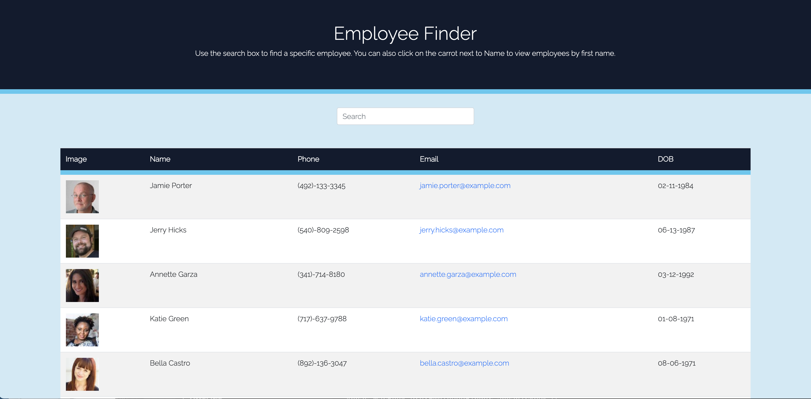

# Employee Finder

A simple React directory to search your employee database.


## Description

A Reach employee directory that allows the user to search an employee database. Users can search by name or click the carrot next to name to sort the employees alphabetically..

## Table of Contents

* [Reference](#reference)
* [Details](#details)
* [Technologies](#technologies)
* [Installation](#installation)
* [Usage](#usage)
* [License](#license)
* [Contributing](#contributing)
* [Questions](#questions)
  
## Reference

Click [here]() to view the live application on GitHub Pages.

Screenshot of application
  

## Details
  * Homepage shows the full employee database, currently genereated by Random User Generator API.
  * Type in an employee's name in the search bar to filter results..
  * Click on the red carrot next to name to view the directory or filtered result alphabetically - either A-Z or Z-A.
  
## Technologies
Technologies used: CSS, JavaScript, React, React-DOM, React-Scripts, Random User Generator API, Axios, Bootstrap.

## Installation

To install all necessary materials for this project, run the following command:

```
npm install
```

## Usage

Be sure to install all node modules and packages locally before using the application.
## License

This application is protected under the MIT license.

For more information, visit this link: [MIT Info](https://opensource.org/licenses/MIT)

## Contributing
Generated users can be replaced by contributor's actual employee database. Design may be changed to the contributors needs and taste.

## Questions

If you have any questions, please reach out.
* GitHub: [AHFotis](https://github.com/AHFotis)
* Email: annahickey2@gmail.com
